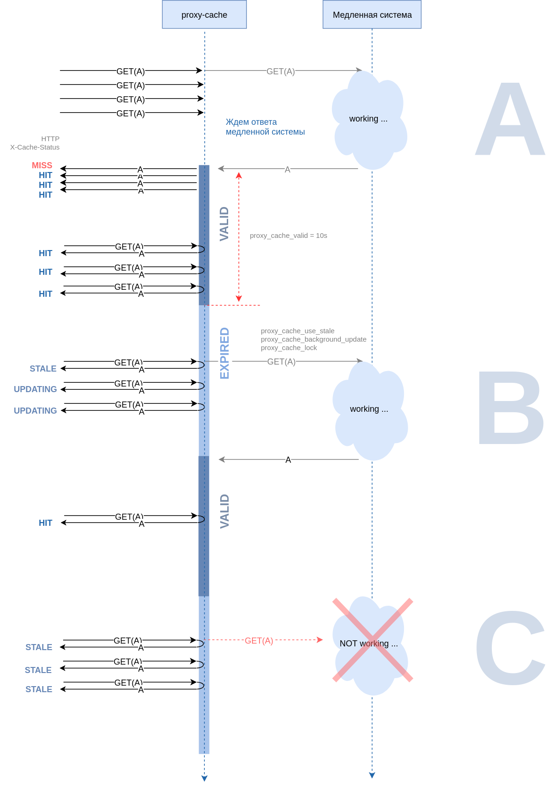

# proxy-cache

### Кэширующий прокси для увеличения пропускной способности (throughput) систем c медленными серверами приложений.

Результаты тестирований
-----------------------

Приложение увеличило пропускную способность тестовой системы с 
исходной пропускной способностью в 1 запрос в секунду до 5000 запросов/сек на 
однопоточных тестах 8-ю конкурирующими соединениями,  и до 500 000 запросов/сек на 
тестах из 100 потоков с 5000-ми конкурирующих соединений не выводя тестовое 
приложение из штатного режима. 

Тесты проводились на компьютере Intel® Core™ i5-3450 CPU @ 3.10GHz × 4 
RAM 16Gb SSD HD Ubuntu 18.04. Для тестирования использовались  ApacheBench, JMeter 
и скрипты  на Golang и Python. В качестве сервера приложений использовалось 
приложение Python и golang приложение `onlinebc` с копией боевой базы данных 
Онлайн Трансляций RG.RU.

Введение
--------

Кэш содержимого находится между клиентом и «исходным сервером» и сохраняет копии 
контента получаемого от сервера. Если клиент запрашивает контент, который хранится 
в кэше, прокси-сервер возвращает контент из кэша. Это повышает 
производительность, поскольку кэш контента ближе к клиенту, и серверам приложений 
не нужно каждый раз генерировать страницы с нуля. 

Работа приложения
-----------------

При запросах клиентов к проксирующему  серверу возможны несколько ситуаций 

### `A` 
Когда приложение получает первый запрос на какой либо ресурс (url A) контент
которого отсутствует в кэше, запрос пропускается к серверу приложений.
Сервер приложений обрабатывает запрос и возвращает ответ прокси серверу.
Прокси сохраняет ответ в кэше и возвращается ответ клиенту с HTTP заголовком 
`X-Cache-Status:MISS`. 

Если во время обработки запроса сервером приложений прокси получил другие запросы клиентов на тот же ресурс, запросы ставятся в очередь и ждут завершения обработки
первого запроса. После получения ответа на запрос, все клиенты получают
ответ из значения сохраненного в кэше. Это поведение задается параметром
`proxy_cache_lock` в файле `proxy.conf`.

Только что сохраненный элемент кэша считается валидным (VALID) в течение 
времени задаваемым параметром `proxy_cache_valid`. Если в течение этого 
времени прокси получает запрос на этот ресурс, ответ из кэша
немедленно возвращается клиенту с заголовком `HIT`.

### `B`
Если прокси получает запрос, и соответствующий элемент кэша просрочен 
(EXPIRED), клиент немедленно получает ответ из кэша с заголовком `STALE`, а 
прокси делает запрос серверу приложений на обновление запроса  в фоновом 
процессе. Если во время выполнения запроса на обновление прокси получает 
запросы на тот же ресурс, всем клиентам возвращается значение из кэша с 
заголовком `UPDATING`. Это поведение регламентируется параметром
roxy_cache_background_update on.

### `C`
Если во время выполнения обновления сервер приложений вышел из строя, 
было потеряно соединение и т.п., клиенты получают значение из кэша с 
заголовком `STALE`. Таким образом обеспечивается непрерывность 
обслуживания клиентов в случае технических неполадок или во время 
проведения рeгламентных работ.

Возможные коллизии.
------------------
Если сервер приложений не отвечает на запрос в течение времени 
определяемым параметром `proxy_cache_lock_timeout`, прокси повторяет 
запрос серверу. Параметр `proxy_cache_lock_age` определяет время после 
которого снимается блокировка с элемента кэша. В любом случае клиенты 
немедленно получают ответы из значений сохраненных в кэше.

Очистка элементов кэша
----------------------
Чтобы очистить элемент кэша нужно подать запрос по заданному URL 
с заголовком "clear-cache:true". Например:

    curl http://localhost:5555/someurl -s -I -H "clear-cache:true"

Приложение
-----------

Приложение выполнено как докер-приложение состоящее из контейнера Nginx. 
Настроечные параметры с описаниями находятся в файле `proxy.conf`. 
В конфигурационный файл можно много путей или регулярных выражений путей. 
Каждый путь может иметь индивидуально заданные параметры времен кэширования.
Файлы кэша располагаются в директории `cache/`.

### RAM disk
Для ускорения доступа к файлам в директорию `cache/` монтируется ram disk, 
чтобы кэш располагался в оперативной памяти компьютера вместо 
диска. Теоретически ram disk может ускорить доступ к кэш в 10 раз по сравнению с 
SSD диском. В тестовых испытаниях различий не обнаружено. Возможно это связано с небольшим объемом кэша используемого в тестовых испытаниях и наличием файлового кэша операционной системы.

Запуск приложения
-----------------

С использованием ram disk.

    sudo ./start.sh

Без ram disk

    docker-compose up -d

Останов 
-------

    CTRL-C

или

    docker-compose down

Тесты
------
Директория `load-tests/` содержит команды тестов для ApacheBench,
настроечные файлы JMeter, приложения на Golang и Python для созданий тестовой нагрузки.

Размещение на боевом сервере
----------------------------

Если на боевом сервере установлен docker-compose, достаточно скопировать папку 
`build/` на боевой сервер и запусить приложение.

Если на сервере docker-compose не установлен, но есть Nginx, можно скопировать `proxy.conf` в директорию
`/etc/nginx/sites-enabled/`

